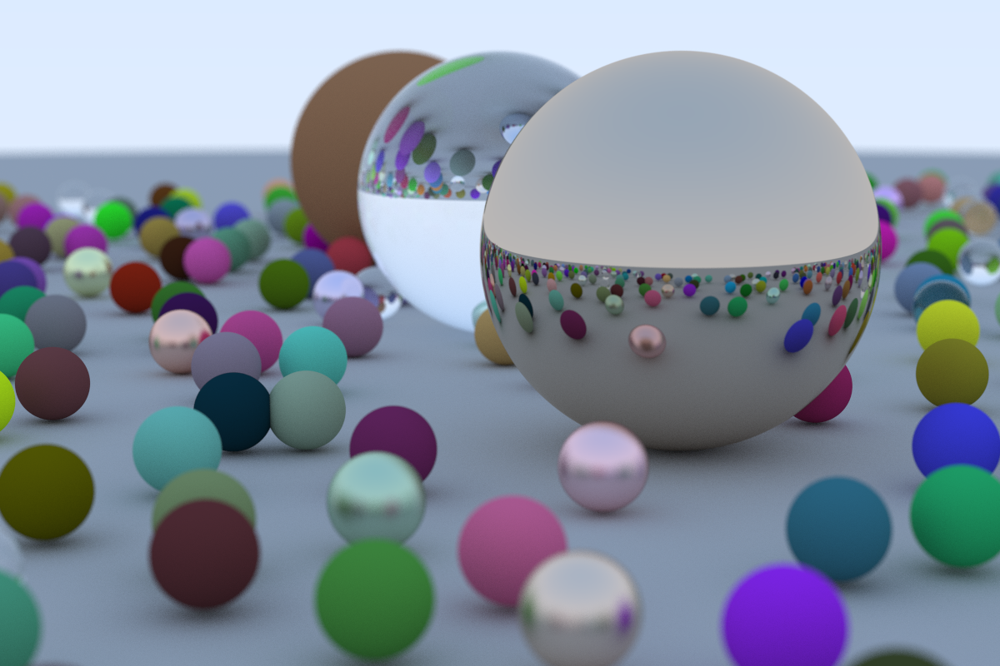

# Ray Tracing in One Weekend

This is an implementation of Book 1 of the [Ray Tracing in One Weekend Book Series](https://raytracing.github.io)
written in Rust.

My intention was to learn Rust and have some fun along the way. Being my first "real" Program in Rust, there's probably
a lot wrong with it. It still works and it's beautiful:

